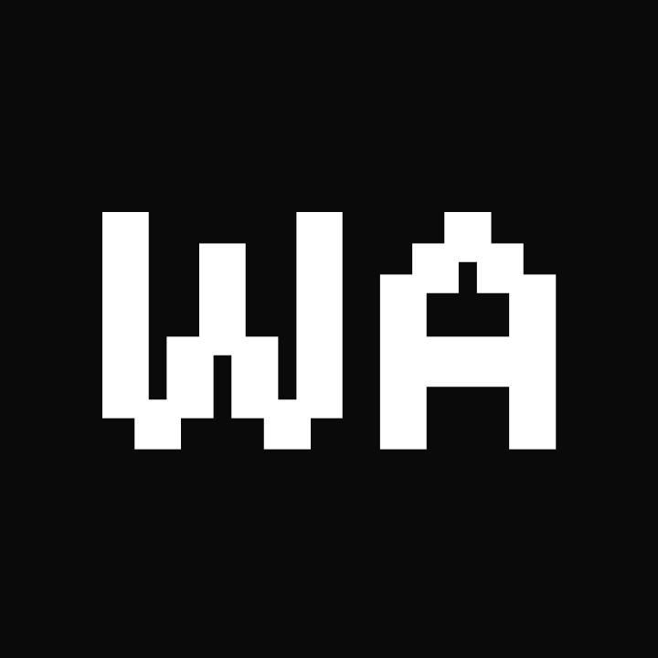

<p align="center">
  
</p>

<h1 align="center">Meu Portfólio</h1>

<p align="center">
  Portfólio pessoal de Willian Alves, desenvolvido para apresentar meu perfil, minhas tecnologias, minha atividade no GitHub e meus projetos.
</p>

<p align="center">
  <a href="https://willianalvesdev.com/">Acessar o portfólio</a>
</p>

<p align="center">
  
  
  
</p>

## Sobre o projeto

O site foi construído do zero com foco em uma interface limpa, responsiva e consistente. Ele reúne informações profissionais, contatos, stack, frequência de contribuições e repositórios públicos do GitHub.

## Tecnologias

- HTML
- CSS
- JavaScript

## Recursos

- Tema claro e escuro com preferência salva no navegador
- Relógio automático no horário de Brasília
- Calendário de contribuições do GitHub
- Listagem dinâmica de projetos públicos
- Links de contato e cartão de contato para download
- Layout adaptado para dispositivos móveis

## Estrutura

```text
assets/       Imagens, ícones, logos e áudio
css/          Estilos do site
js/           Interações e integrações
index.html    Página principal
404.html      Página de erro
llms.txt      Informações do site para modelos de linguagem
robots.txt    Orientações para mecanismos de busca
```

## Autor

[Willian Alves](https://github.com/willianalvesdev)
